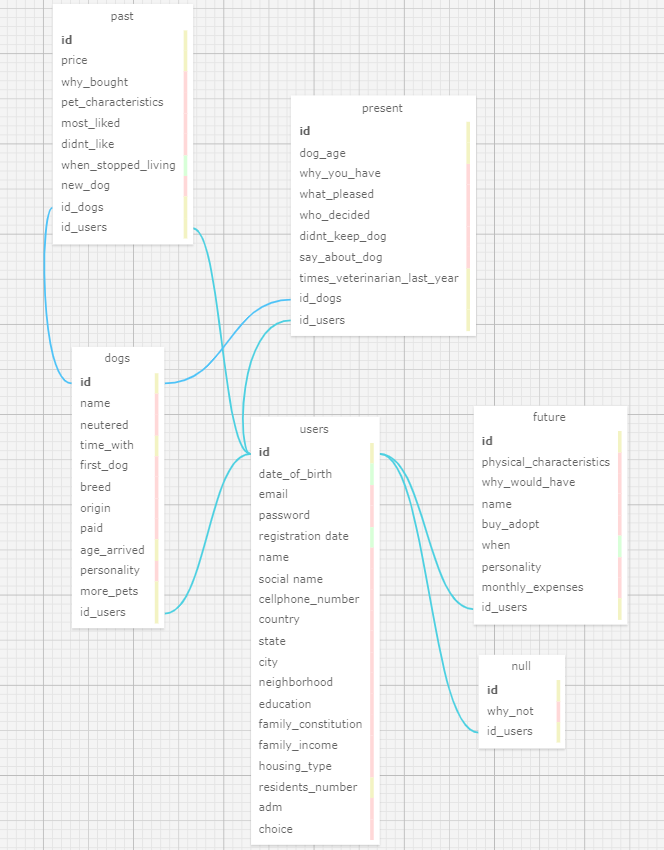

## Documentação Simplificada do Modelo Relacional

**Projeto:** Abandono Zero

**Data:** 2024-05-12

**Autor:** Sophia Emanuele de Senne Silva

**Objetivo:** Descrever o modelo relacional do projeto de forma resumida e simplificada.

## Entidades

- **Usuários** (`users`): Armazena informações sobre os usuários (nome, email, etc.).
- **Formulários**
  - **Possuir Cão** (`present`): Informações sobre o cão que o usuário possui (vezes no veterinário, idade, etc.).
  - **Já Teve Cão** (`past`): Informações sobre o cão que o usuário já teve (preço, características, etc.).
  - **Deseja Cão** (`future`): Informações sobre o cão que o usuário deseja ter (características físicas, nome, etc.).
  - **Sem Cão** (`null`): Motivo pelo qual o usuário não tem e não deseja ter um cão.
- **Cão** (`dogs`): Informações extras sobre o cão que o usuário possui ou possuiu (nome, gênero, castrado, etc.).

## Relacionamentos

- Um usuário pode ter vários formulários de cães (N:M).
- Um formulário de "Cão" pode ter um único registro de "Possuir cão" ou um de "Já teve cão".
- Todas as tabelas se relacionam com "users" a fim de facilitar as consultas.

## Regras de Negócio

- Todos os campos obrigatórios devem ser preenchidos.
- As informações devem ser consistentes entre os formulários.
- Os usuários não podem editar informações já salvas, exceto em casos específicos.
- As informações dos usuários são confidenciais.

## Diagrama

Figura 1 - Diagrama simplificado do modelo relacional

Fonte: Material produzido pela autora (2024)

## Considerações Finais

Este modelo relacional simplificado fornece uma base para o gerenciamento eficiente das informações dos usuários e suas respostas nos formulários do projeto Abandono Zero. As entidades, seus atributos e relacionamentos garantem a organização e a integridade dos dados. As regras de negócio garantem a consistência e a confiabilidade das informações.

